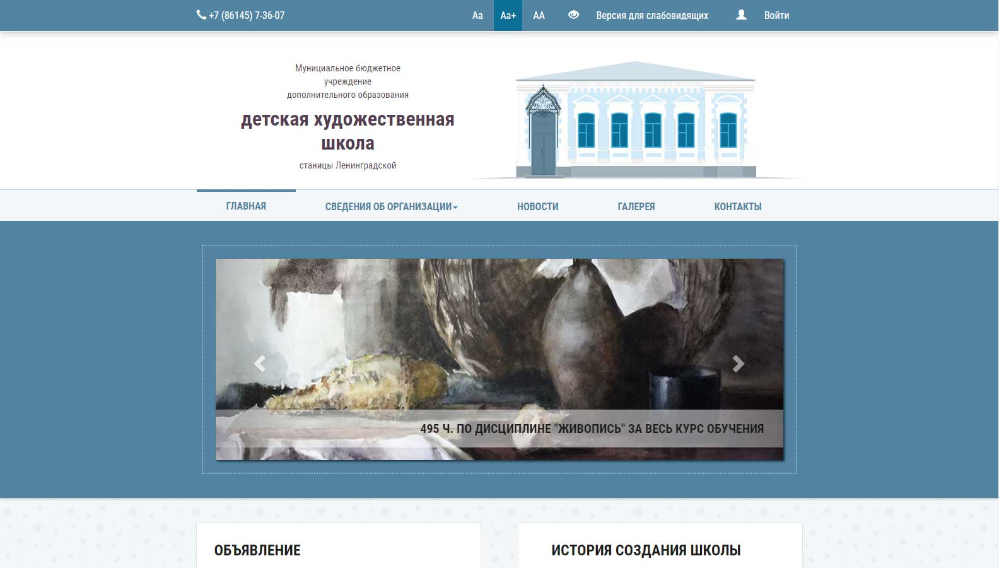

# Сайт детской художественной школы

Используется Laravel, SCSS, Gulp
Официальный сайт в сети: http://dxsh.ru
На GitHub более доделанная современная версия, есть возможность сравнить с самой первой. Шаблон частично использует Boostrap в минимальном количестве, свой модуль для слабовидящих, который уже выглядит привлекательнее имеющихся.

##
- [x] Сделать основы шаблона
- [x] Сделать шаблон адаптивным под все разрешения
- [ ] Модуль для слабовидящих по всем стандартам
- [ ] Административная часть сайта
- [ ] Галерея

